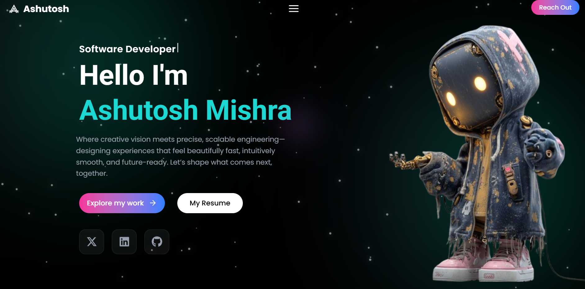

# 🚀 Portfolio — Modern React Developer

[](https://vitejs.dev/) [](https://reactjs.org/) [](https://tailwindcss.com/) [](#)

Professional, animated, responsive portfolio website built with React, Vite, Tailwind CSS and Framer Motion. Designed to showcase projects, skills, and provide an easy resume download for hiring managers.

---

## 🔍 Overview

This repository contains a modern personal portfolio website featuring an animated hero, skills carousel, projects gallery, and contact section. It's optimized for fast development with Vite and styled using Tailwind CSS. The UI uses Framer Motion for smooth animations and React Icons for crisp icons.

Key highlights:
- Animated hero with entrance transitions
- Interactive skills carousel
- Project cards with live/demo & repo links
- Resume download (drop your `resume.pdf` in `public/`)
- Responsive, accessible, and performance-minded

---

## ✨ Features

- 🔹 Animated hero section (Framer Motion)
- 🔹 Skills carousel with icons and levels
- 🔹 Projects section with images, descriptions, and links
- 🔹 Resume download button (static `public/resume.pdf`)
- 🔹 Responsive layout (mobile-first) with Tailwind CSS
- 🔹 Accessible markup and keyboard-friendly interactions
- 🔹 Easy deployment to Vercel / Netlify

---

## 🛠️ Tech Stack

- React
- Vite
- Tailwind CSS
- Framer Motion
- React Icons
- Node.js / npm

---

## ⚙️ Installation

Clone the repository and install dependencies.

```powershell
# Clone
git clone https://github.com//mishraashutosh25/my-portfolio.git
cd my-portfolio

# Install dependencies
npm install
```

---

## ▶️ How to Run (Local)

Start the dev server and view the site locally.

```powershell
# Start development server (Vite)
npm run dev

# Build for production
npm run build

# Preview production build locally
npm run preview
```

Tip: If you use PowerShell and run into script execution warnings, run PowerShell as Administrator or adjust `ExecutionPolicy` for the session.

---

## 📁 Project Structure

- `index.html` — HTML entry
- `src/` — React source
	- `src/main.jsx` — app bootstrap
	- `src/App.jsx` — root component
	- `src/components/` — UI components (Navbar, Hero, Projects, Skills, Contact, etc.)
- `src/index.css` — Tailwind + custom styles
- `public/` — static assets (add `resume.pdf` and screenshots here)

---

## 💼 Projects

| Project | Description | Tech | Live / Repo |
| --- | --- | --- | --- |
| Awesome Portfolio | Personal portfolio template with animations and projects gallery | React, Vite, Tailwind, Framer Motion | [Live](https://your-live-url) • [Repo](https://github.com/your-username/your-repo) |
| Project Two | Brief description of project two | React, Node, Tailwind | [Live](#) • [Repo](#) |
| Project Three | Brief description of project three | React, Express, MongoDB | [Live](#) • [Repo](#) |

Replace the above rows with your real projects. For each project, include a short description, the main technologies used, and links to both a live demo and the repository.

---

## 🖼️ Screenshots

Place screenshots in `public/` or `public/screenshots/`. Use the exact filenames below or update the paths if you move files.

### 🏠 Hero Section  

<a href="public/hero.png">
	
</a>

Click the image to view the full-size screenshot. Using a relative path (`public/hero.png`) ensures GitHub renders the image correctly from this repository.

### 🧠 Skills Section  


---

## 🔗 Live Demo

Visit the live site:

🔗 https://your-username.vercel.app (replace with your deployed URL)

You can deploy quickly with Vercel or Netlify. Connect the repo, set build command to `npm run build` and publish directory to `dist`.

---

## 📥 Resume

Add your resume to `public/resume.pdf`. The site links to `/resume.pdf` for download.

Example HTML snippet (if needed):

```html
<a href="/resume.pdf" download class="btn">Download Resume</a>
```

---

## 📨 Contact

- **Email:** yourname@example.com
- **GitHub:** https://github.com/your-username
- **LinkedIn:** https://www.linkedin.com/in/your-profile

Feel free to open an issue or create a PR for suggestions or improvements.

---

## 🤝 Contributing

Contributions are welcome — fork the project and open a pull request. For major changes, please open an issue first to discuss your ideas.

---

## 📜 License

This project is licensed under the MIT License — see the `LICENSE` file for details.

---

Thank you for checking out this portfolio — built with a focus on performance, accessibility and delightful animations. ✨
