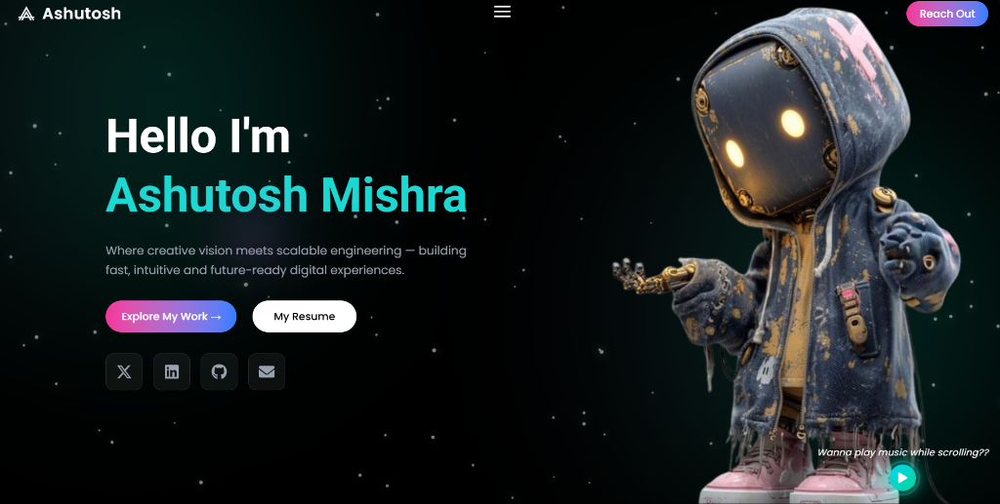
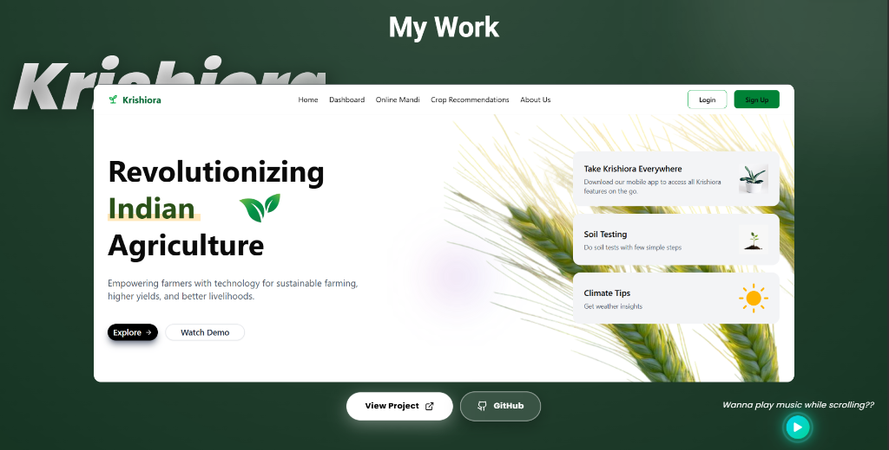
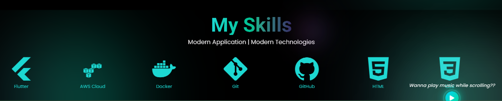

<div align="center">
  <!-- TODO: User will provide logo if any, otherwise we can remove this line later -->
  <h1 align="center">Ashutosh Mishra | Full-Stack Software Developer</h1>

  <p align="center">
    An industry-grade, interactive personal portfolio website built with modern web technologies.
    <br />
    <a href="https://ashutoshdevprotfolio.netlify.app/"><strong>View Live Demo »</strong></a>
    <br />
    <br />
  </p>
</div>

<!-- OUTLINE -->
<details>
  <summary>Table of Contents</summary>
  <ol>
    <li><a href="#about-the-project">About The Project</a></li>
    <li><a href="#showcase">Showcase</a></li>
    <li><a href="#key-features">Key Features</a></li>
    <li><a href="#tech-stack">Tech Stack</a></li>
    <li><a href="#getting-started">Getting Started</a></li>
    <li><a href="#project-structure">Project Structure</a></li>
    <li><a href="#contact">Contact</a></li>
  </ol>
</details>

---

##  About The Project

<!-- HERO IMAGE PLACEHOLDER -->


This repository contains the source code for my professional developer portfolio. It is designed from the ground up to be fully responsive, highly performant, and visually engaging. It serves as a dynamic showcase of my software engineering journey, technical skills, and enterprise-level projects such as **Oralytics AI**, **Krishiora**, and **ArogayLink**.

The underlying architecture follows strict industry standards, featuring decoupled data models, custom hooks, reusable UI components, and strict linting.

---

## 📸 Showcase

I have meticulously designed different sections to guide visitors through my professional journey:

### 1. The Projects Showcase
Rich, dynamic 3D-like scrolling cards that elegantly present my best work. 
<!-- PROJECTS SCREENSHOT PLACEHOLDER -->


### 2. Experience & Skills
A timeline-based layout detailing my professional workflow combined with a dynamic tech-stack grid.
<!-- SKILLS SCREENSHOT PLACEHOLDER -->


### 3. Contact & Connectivity
A secure, validation-backed contact form powered by EmailJS, allowing direct communication without backend server reliance.

---

## ✨ Key Features

- **Modern UI/UX:** Clean, dark-mode aesthetic with custom glassmorphism and gradient blobbing.
- **Advanced Animations:** Scroll-driven animations, parallax effects, and smooth page transitions powered by **Framer Motion**.
- **Data-Driven Architecture:** All configurable content (Skills, Projects, Experience, Testimonials) is cleanly separated into a single `constants.jsx` file for O(1) maintainability.
- **Form Validation:** The Contact section utilizes **React Hook Form** combined with **Zod** schema validation to ensure robust security and UX before interacting with EmailJS APIs.
- **Mobile First & Responsive:** Custom `useIsMobile` hooks and Tailwind utility classes ensure a flawless 60FPS experience across all devices.
- **Global Tooling:** Prettier & ESLint configured to enforce strict industry-standard code formatting.

---

## 🛠️ Tech Stack

**Core**
- [React.js](https://reactjs.org/) (Vite)
- [Tailwind CSS](https://tailwindcss.com/)
- [Framer Motion](https://www.framer.com/motion/)

**Form & Utilities**
- [React Hook Form](https://react-hook-form.com/)
- [Zod](https://zod.dev/)
- [EmailJS](https://www.emailjs.com/)
- [Clsx](https://www.npmjs.com/package/clsx) & [Tailwind Merge](https://www.npmjs.com/package/tailwind-merge)

**Deployment**
- Configured for easy deployment on platforms like Vercel or Netlify.

---

## 🚀 Getting Started

Follow these instructions to set up the project locally on your machine.

### Prerequisites

You need to have Node.js installed. We recommend Node `v18.0.0` or higher.
* npm
  ```sh
  npm install npm@latest -g
  ```

### Installation

1. **Clone the repo**
   ```sh
   git clone https://github.com/mishraashutosh25/my-protfolio.git
   ```
2. **Install NPM packages**
   ```sh
   cd my-protfolio
   npm install
   ```
3. **Set up Environment Variables**
   Create a `.env` file in the root directory and add your EmailJS credentials:
   ```env
   VITE_SERVICE_ID=your_emailjs_service_id
   VITE_TEMPLATE_ID=your_emailjs_template_id
   VITE_PUBLIC_KEY=your_emailjs_public_key
   ```
4. **Run the Development Server**
   ```sh
   npm run dev
   ```

---

## 📂 Project Structure

```text
src/
├── assets/          # Static media (Images, PDFs, Icons)
├── components/      # Reusable UI widgets (Navbar, InputField, Buttons)
├── data/            # Centralized content constants (constants.jsx)
├── hooks/           # Custom React hooks (useIsMobile.js)
├── sections/        # Major page layout sections (Home, Projects, About)
├── App.jsx          # Root component wrapping the layout
└── main.jsx         # React application entry point
```

---

## 📫 Contact

**Ashutosh Mishra**  
- Twitter: [@devma25](https://x.com/devma25)
- LinkedIn: [Ashutosh Mishra](https://www.linkedin.com/in/ashutoshmishradev12/)

Project Link: [https://github.com/mishraashutosh25/my-protfolio](https://github.com/mishraashutosh25/my-protfolio)

---
<div align="center">
  <i>Built with ❤️ by Ashutosh Mishra</i>
</div>

<!-- MARKDOWN LINKS & IMAGES -->
[product-screenshot]: ./docs/hero.png
